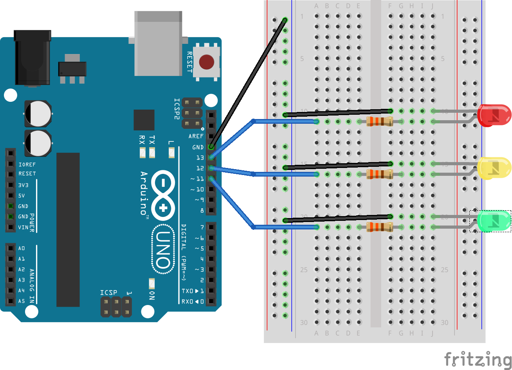

#Express-Arduino

Basic configuration for a simple express application connecting to an arduino through johnny-five. 

##Node Setup

Install the required modules:

> `npm install`

To use the johnny-five module with the arduino board, you need to upload specific firmata to the board. More information and initial setup for the Johnny Five module can be found at:
[https://github.com/rwaldron/johnny-five](https://github.com/rwaldron/johnny-five)

####Express Modules

* Express 4
* Swig Templates using the Consolidate module
* Body Parser for handling POST data

##Arduino Setup

* Created with Arduino Uno
* Breadboard
* 1 Red, 1 Yellow and 1 Green LED
* 3 wires for power/signal, 4 wires for ground
* 3 330 ohm resistors

####Wiring Diagram

##Starting The Application

With the arduino board wired and connected via usb, start the express server:

> `node index.js`

When starting the server you should see the following console messages:

> `Express server listening on port 3000`

> `>> Board Ready`

Once started, in your browser visit:

> [http://localhost:3000](http://localhost:3000)

This page should display a red button for on and a black button for off for each led color. Clicking on the on/off buttons should turn the respective LEDs on/off through the arduino board. 

##Using the Application

####Express Configuration
The application will be bootstrapped through the express-setup.js file in the base directory. The code is organized inside the base app folder into model, view, controller and routes folders. The express-setup.js file will walk the contents of the app/routes folder for all available routes.

The johnny-five code is declared in app/controllers/led-sample.js and is required by  app/controllers/index.js.

The initial page code is located at /app/views/index.html. Using the default templating, a separate header and footer are located in the /app/views/layout folder. 

####Public Files

Express is configured to serve static files from the /public directory.

**JavaScript**

This application uses jQuery 2.1.3 and a simple main.js file located at /public/js.

Included in the main.js file are two AJAX helper functions, one for POST and one for GET requests, along with button event triggers for sending AJAX requests that can serve as a sample for using the helper functions. 

**CSS**

There is a starter CSS stylesheet that is currently styling the on/off buttons located at /public/css/style.css.

**Images**

Included is a sample favicon and directory for including images at /public/img.
